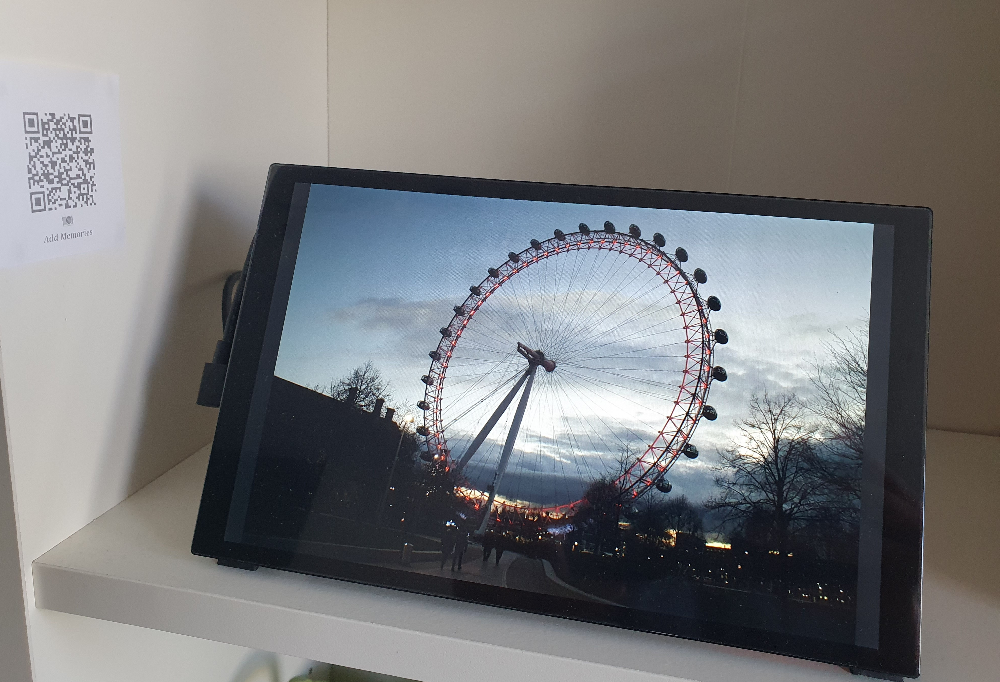

# Raspberry Pi touch photo frame

A DIY digital photo frame built around a **Raspberry Pi 4**, a **GeeekPi 10.1″ capacitive HDMI touchscreen** (1280×800), **[Sway](https://swaywm.org/)** (Wayland), **Chromium** kiosks, **[home-gallery](https://github.com/BenjaminCIQ/home-gallery)** for the slideshow, **Nextcloud** + folder sync, and **lisgd** for touch gestures. This repo holds the configs and systemd units used on the device.



## Features

- Multi-workspace **Chromium kiosk** sessions (calendar, local gallery, Spotify, etc.) via `launch_kiosks.sh` and `kiosk_launcher/config`
- **home-gallery** Node server for photos; optional **Nextcloud** + **photoframe-sync** timer for library sync
- **lisgd** gestures (e.g. two-finger horizontal swipes for workspace switching via **wtype**)
- **wvkbd** on-screen keyboard helpers for touch typing
- **systemd** units for gesture daemon, scheduled display toggle, and sync

## Hardware

- **Raspberry Pi 4**
- **GeeekPi 10.1″** HDMI capacitive touch display (mounts the Pi on the back)
- Optional external photo storage (e.g. mounted under `/media/ExtPhotos`)

## Tested software image

Configurations were developed on **Raspberry Pi OS (64-bit)**, **Debian 13 (trixie)** — e.g. the [2025-12-04 raspios trixie arm64](https://downloads.raspberrypi.com/raspios_arm64/images/raspios_arm64-2025-12-04/) image. `/etc/os-release` may show “Debian” even though the image is Raspberry Pi OS; the kernel is typically `…+rpt-rpi-v8` (aarch64).

## Quick start

On the Pi, clone this repo and run:

```bash
./scripts/install.sh
sudo ./scripts/install.sh --systemd
# optional: sudo ./scripts/install.sh --systemd --enable
```

That copies Sway configs from `home/user/.config/sway/` to `~/.config/sway/`, and (with `--systemd`) installs units under `/etc/systemd/system/` with **`User=` / `Group=`** set to your login UID/GID (`SUDO_USER` when using `sudo`). Repo defaults use UID **1000**; the install script rewrites those lines to match.

Then follow **[setup.md](setup.md)** for packages, Nextcloud, home-gallery build, multi-touch (**labwc** `mouseEmulation="no"` + [CNX Software article](https://www.cnx-software.com/2025/03/12/tips-to-use-a-touchscreen-display-with-raspberry-pi-os-in-2025/)), and optional Nextcloud `StoragesController.php` note.

## Repository layout

| Path | Purpose |
|------|---------|
| `home/user/.config/sway/` | Sway config, kiosk launcher, helper scripts (deployed to `~/.config/sway/`) |
| `etc/systemd/system/` | `lisgd`, `photoframe-sync@`, `display-toggle` services and timers |
| `scripts/install.sh` | Install configs and systemd units with correct UID/GID |
| `setup.md` | Full setup notes (packages, Nextcloud, gallery, sync) |

## Documentation

All detailed steps, quirks, and package list live in **[setup.md](setup.md)**.

## License

[MIT](LICENSE)
